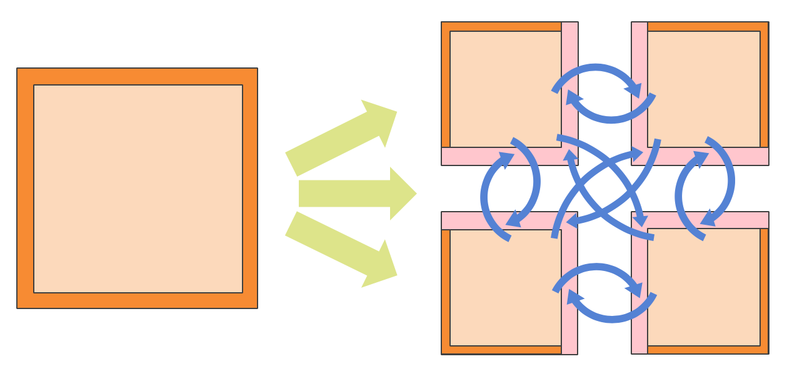
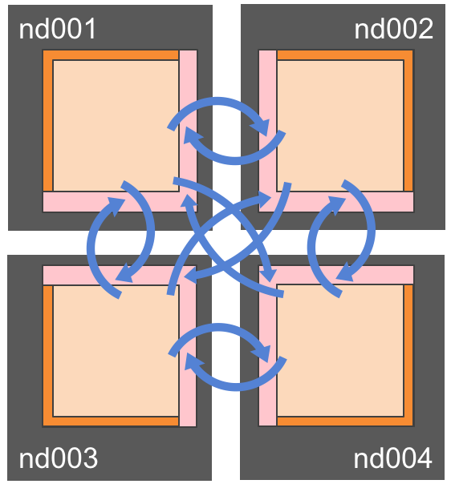
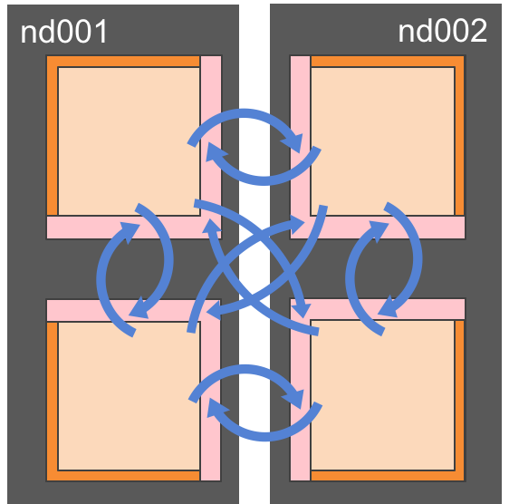
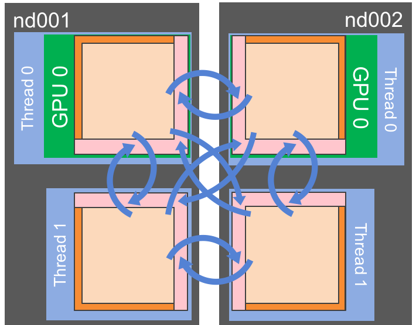
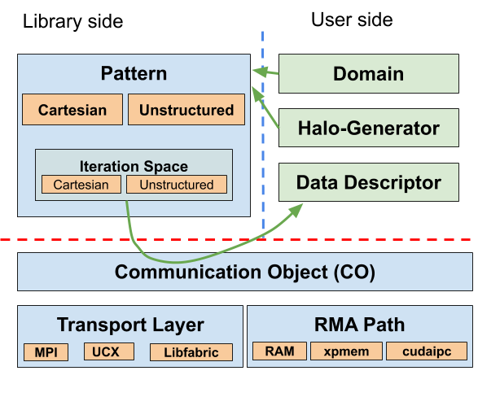

.. include:: ../defs.hrst

.. _scope:

============================
Scope and objectives of GHEX
============================

|GHEX| is a C++ library to perform halo-update operations in mesh/grid applications in modern HPC
architectures. Domain decomposition refers to the technique that applications use to distribute the
work across different processes when numerically solving differential equations. For instance, see
the next figure for a schematic depiction of this idea.

    Example of Domain Decomposition. The physical domain, on the left, is split into 4 different
    sub-domains. To allow for the computation to progress without having to remotely access every
    single element that resides on a remote process, the application uses **ghost regions**, or
    **halos** (in pink), that need to be updated whenever the computation requires accesss to that
    region.  The blue arrows show the communication pattern, also referred in the manual as
    **halo-update**, or **halo-exchange** operation.

    Traditional distributed memory data distribution: one process (MPI rank) is responsible for one
    sub-domain of the decomposed domain.

    Each process in a node can manage more than one sub-domain, for instance to achieve load
    balancing (over-subscription).

.. figure:: figures/multi_threads.png
    :width: 300px
    :align: center
    :alt: This should not be visible
    :figclass: align-center

    The over-subscription can be a tool to improve the parallelization in each process by running
    computations in independent threads.

    Using accelerators is certainly one of the most attractive options for running HPC applications
    on current and near future platforms. The execution can be symmetric, or hybrid.

The objective of |GHEX| is to enable halo-update operations

    - for traditional domain decomposed distributed memory applications (i.e., one domain per node)
      either on CPUs or GPUs

    - for applications applying over-subscription on a node, either for latency hiding or for
      exploiting multi-threading

    - for application exploiting hybrid systems (nodes with multiple address spaces and multiple
      computing devices)

    - regardless of the specific representation of the grid/mesh (by using *adaptors*)

    - on architectures that provide access to transport mechanisms other than MPI (e.g., ``UCX`` and
      ``Libfabric``) whose performance may be higher

In order to accomplish all of the above, the interfaces to |GHEX| requires a non trivial amount of
work on the user side.  The reward for this work is: portability to multiple architectures, with and
without accelerators, with the possibility to exploit native transport mechanisms. Depending on the
complexity of the application, a user can easily adapt it to use different number of threads, or
different types of threads. |GHEX| can accommodate these requirements quite flexibly.

----------
Features
----------

|GHEX| employs a number of different communication strategies to improve performance of information
exchange. In particular, the following features are available:

    - off-node access: use of a buffered communication for remote neighbors and reduction of the
      amount of messages by coalescing data with the same destination into larger chunks

    - in-node access: taking advantage of direct memory access within a shared memory region when
      run with multiple threads (native) or when run with multiple processes (through *XPMEM*)

    - latency hiding: computation - communication overlap is possible through an explicit
      future-like API

    - cache friendliness: structured grids are traversed in a cache-friendly way to avoid cache
      misses when serializing/deserializing data (for remote connections) and when directly
      accessing memory (for node-local connections)

    - avoid serialization: certain types of unstructured meshes can be configured such that
      serialization on one side of the communication can be avoided

    - heterogeneity of data: different types of data (with different neighbor regions) may be
      exchanged in one go

    - GPU accelerators: carefully tuned serialization kernels which exploit the bandwidth and
      asynchronous execution

--------------------------
Type of interfaces
--------------------------

|GHEX| has a layered structured. The user can enter at different layers, depending on their needs.
The highest level is the ``halo exchange`` level, where the user instructs |GHEX| to take a mesh or
grid representation and produce a ``communication pattern`` to then perform the halo update
operations.

In order to enable all the previously mentioned features, like oversubscription, alternate
transport layers and hybrid computations, the steps to create a pattern and use it to communicate
can seem overly complicated. While we are working on shortening the number of steps to take for
simple cases, more complex cases seem to require these complications, and hence they cannot be
avoided. As we expect applications to become more and more complex in the future, we think the use
cases in which the interfaces provided by |GHEX| will increase and overshadow the traditional
distributed memory applications simply based on MPI.

The main concepts needed by |GHEX| are:

    - **Context** : Provides information to the application about network connectivity. A computing
      node, that can be identified with a process (or an MPI rank, for instance) needs some
      information about how it is connected to other processes.

    - **Communicator**: Represents an end-point of a communication, and is obtained from the
      context (this are hidden when using the halo-exchange facilities, this is why the description
      is placed at the end of the chapter).

    - **Communication Pattern**: Provides application-specific neighbor connectivity information
      (encodes exposed halos for sending and receiving, for instance)

    - **Communication Object**: Is responsible for executing communications by tying together
      *Communication Pattern*, *Communicator*, and user-data.

The following figure depicts the different components and their interactions:

    |GHEX| Software architecture. On the right the main libraru components to set up the halo update 
    operations, on the bottom the main components to perform the exchanges, on the right the user
    input required by GHEX.

Domains, halo-generators, and data descriptors are provided by the users, while the light-blue boxes
are provided by the GHEX library. Some user provided components are also provided by GHEX if
their implementation is found on common infrastructures, for instance, in Cartesian grids, or
ParMeTis partitioned graphs, or the Atlas library for meshing and domain decomposition by ECMWF.

All these components live in **contexts**, that are the only platform specific interfaces of GHEX.
This allows for the GHEX codes to be portable across architectures in the sense that the sections
of the code impacted by the different characteristics of the architectures are confined in limited
places that can be easily controlled.

------------------------
Context
------------------------

The context manages the underlying transport layer. Among its tasks are initialization, connectivity
setup, communication end-point management, network topology exploration. It is the first GHEX entity
that is created and the last that is being destroyed (enclosed only by MPI initialization and finalization).  Contexts maintain state information that the
*communicators* need in order to function. In other words, communicators (presented below) cannot
outlive the contexts from where they were obtained. Initialization of contexts is platform specific,
since different transport layers require different information in the setup phase. Contexts assumes
that MPI is already initialized at the time of initialization. An MPI communicator is passed to it as
first argument, while subsequent arguments may be required for non-MPI transport layers, such as UCX
and Libfabric.

|GHEX| assumes the availability of an MPI library implementation on the platform.
While this is not strictly needed conceptually, the vast majority of HPC applications rely on MPI
(for instance by using PGAS languages or runtime-systems such as HPX) and, thus, we can take
advantage of the infrastructure provided through MPI for our implementation. This simplifies creation
of contexts and collection of information about which processes participate in the computation.
Therefore, the context requires an MPI Communicator as runtime argument, in addition to other
possible transport specific arguments.  The passed MPI Communicator will be cloned by the context.
For this reason the context should be destroyed before the call to ``MPI_Finalize``.

Contexts are constructed for a specific *transport layer*. The available transport layers are: MPI,
UCX, and Libfabric. The transport layer is represented by a *tag* passed as template argument to the
context type.

In order to guarantee uniform initialization of the contexts, which are highly platform dependent,
the user should not call the constructor of the context directly, but instead the use should use a
factory, which returns a ``std::unique_ptr`` to context object instantiated with the proper
transport layer. The syntax looks like this:

.. code-block:: cpp

    #ifdef USE_UCX
    using transport = gridtools::ghex::tl::ucx_tag;
    #else
    using transport = gridtools::ghex::tl::mpi_tag;
    #endif

    auto context_ptr = gridtools::ghex::tl::context_factory<transport>::create(MPI_COMM_WORLD, other_args);

In the above example the use of ``#ifdef`` is an example of how code can be made portable by minimal
use of macros, and a recompilation.

From the context, additional information can be obtained, such as the
``context<TransportTag>::rank()``, which is the unique ID of the process in the parallel execution,
and ranges from 0 to ``context<TransportTag>::size() - 1``.

A context object is instantiated by the processes, but different processes in a computation should
instantiate contexts in the same order. The contexts instantiated, one per process, form a kind of
*distributed context*, since they are *connected* to one another. Suppose we have the following
code, executed by a certain number `P` of processes:

.. code-block:: cpp

    auto context_ptrA = gridtools::ghex::tl::context_factory<transport>::create(MPI_COMM_WORLD);
    auto context_ptrB = gridtools::ghex::tl::context_factory<transport>::create(MPI_COMM_WORLD);

The instances of ``context_ptrA`` in the `P` processes form a distributed context, those instances
are connected to one another. The communicators (see below) obtained from it can communicate to one
another directly. The same for the communicators obtained from ``context_ptrB``. Communicators from
``context_ptrA`` cannot communicate directly to communicators from ``context_ptrB``.

.. note::

   **Thread safety:** A context shall be created in a (process-)serial part of the code.
   Usage of a context is thread-safe.

------------------------
Communication Pattern
------------------------

In order to perform halo-update operations, the user needs to provide information about the domain,
the domain decomposition, the sizes of the halos and the access to the data.
One of the most important aspects of |GHEX| is the choice of not imposing a domain decomposition
strategy, that would possibly result in sub-optimal solutions or not match the developer thinking process.
Instead, the user is providing descriptions of the above mentioned concepts as adaptors to their
implementation.  After all, domain
decomposed applications all have to refer to similar information, even though the encoding of this
information differs in all sorts of details in different applications.
The user of |GHEX| needs to provide standard functions that |GHEX| will call to gather/access the
necessary information, and these functions form a thin layer that interfaces the specific domain
decomposition implementation and |GHEX|. We are providing some components directly, in order to
facilitate the interfacing in the most common cases and showcase the approach.

The *communication pattern* itself encodes the neighbor information with respect to a
domain decomposition and halo shapes.
The way |GHEX| digests user input is through adaptor classes. Since structured and unstructured
grids are rather different, we have decided to specialize all concepts and classes for either case. Let us
first look at the structured grids.

For a given application, the following concepts need to be implemented:

- **domain descriptor:** a class which describes a domain which provide (at least) the following interface

.. code-block:: cpp

    // this class must be (cheaply) copy constructible.

    public: // member types
        using domain_id_type      = ...;  // a globally unique id type which can be compared
        using dimension           = ...;  // A integral constant
        using coordinate_type     = ...;  // An array-like type

    public: // member functions
        domain_id_type domain_id() const;     // returns the id
        const coordinate_type& first() const; // returns the coordinate to the first (physical)
                                              // point in global coordinates
        const coordinate_type& last() const;  // returns the coordinate to the last (physical)
                                              // point in global coordinates

Note that the constructors, or any additional functionality, are not shown here, since they are not needed by |GHEX|. The user of |GHEX| construct those and give the objects with those prescribed characteristics to |GHEX|.

The ``domain_id_type`` needs to be comparable, and at least operators ``<`` and ``==`` should be provided.

- **domain region**

.. code-block:: cpp

    public: // member functions
        const coordinate_type& first() const;
        const coordinate_type& last() const;

- **halo region**

.. code-block:: cpp

    public: // member functions
        const domain_region& local() const;
        const domain_region& global() const;

- **halo generator:** a class which generates a halo given a domain descriptor, with the following
  interface

.. code-block:: cpp

    public: // member functions
        std::vector<halo_region> operator()(const domain_descriptor& dom) const;
        halo_region intersect(const domain_type& d,
            const coordinate_type& first_a_local,  const coordinate_type& last_a_local,
            const coordinate_type& first_a_global, const coordinate_type& last_a_global,
            const coordinate_type& first_b_global, const coordinate_type& last_b_global) const;

Creation of a pattern container:

.. code-block:: cpp

        template<typename GridType, typename Transport, typename HaloGenerator, typename DomainRange>
        auto make_pattern(context<Transport>& context, HaloGenerator&& hgen, DomainRange&& d_range);

with ``GridType`` equal to ``structured::grid``.

In the case of unstructured grids:

------------------------
Communication Object
------------------------

- **field descriptor:**

.. code-block:: cpp

    public: // member types
        using value_type      = ...; // fields value type
        using arch_type       = ...; // fields location (cpu or gpu)
        using dimension       = ...; // integral constant with the number of dimensions
                                     // including possible additional dimensions due to
                                     // multiples components
        using layout_map      = ...; // memory layout (gridtools::layout_map<...>)
        using coordinate_type = ...; // an array-like type with basic arithmetic operations

    public: // queries
        typename arch_traits<arch_type>::device_id_type device_id() const;
        domain_id_type domain_id() const;
        const coordinate_type& extents() const;
        const coordinate_type& offsets() const;
        const auto& byte_strides() const;
        value_type* data() const;
        int num_components() const;
        bool is_vector_field() const;

    public: // member functions
        template<typename IndexContainer>
        void pack(value_type* buffer, const IndexContainer& c, void* arg);

        template<typename IndexContainer>
        void unpack(const value_type* buffer, const IndexContainer& c, void* arg);

------------------------
Communicator
------------------------

A context generates and keeps communicators. A communicator represents the end-point of a
communication and is obtained from a context.  Communicators coming from different contexts cannot
communicate with one another, creating isolation of communications, which is useful for
program composition and creating abstractions.

To get a communicator, the user calls

.. code-block:: cpp

    auto comm = context_ptr->get_communicator();

In order to keep the API simple, ``get_communicator`` will return a *new* communicator every time
the function is invoked. The function is thread safe, and each thread of the computation can call it
and obtain a unique communicator object. A thread should call ``get_communicator`` only to get the
communicator objects it needs and should *never* invoke ``get_communicator`` to retrieve a
previously generated communicator. The user is *responsible* for keeping the communicators alive for
the duration needed by the computation. ``get_communicator`` must be called once for each
communicator instance needed.

.. note::

   If an application is only concerned with available high-level halo-exchange facilities
   (implemented in the *patterns* and *communication objects*, see below), a communicator is never
   directly used by the application.  The API of the communicator explained below may however be
   used to implement more complex scenarios where the application does not follow the typical bulk
   halo exchange strategy.

Once a communicator is obtained, it can be used to send messages to, and receive from, other
communicators obtained from the same distributed context, as explained in the previous Section.

Communicators can communicate with one-another by sending messages with tags. There are two types of
message exchanges: `future based` and `call-back based`. The destination of a message is a ``rank``,
that identifies a process/context, and a ``tag`` is used to match a receive on that rank.

Communicators do not directly communicate to one-another, they rather send a message to a *context*
and by using tag-matching the messages are delivered to the proper communicator requesting a particular tag. Communicators are
mostly needed to increase concurrency, since different channels can be multiplexed or demultiplexed,
depending on the characteristics of the transport layer.

For instance, when using the MPI transport layer, multiple ``Isends`` and ``Irecvs`` are issued by
different communicators, and the concurrency is managed by the MPI runtime system that should be
initialized with ``MPI_THREAD_MULTI`` option. In UCX we can exploit concurrency differently: each
communicator has its private end-point for sending, while the receives are all channeled through a single
end-point on the process. This choice was dictated by benchmarks that showed this solution was the
most efficient. The same code runs with MPI and UCX transport layers, despite a different way
of handling concurrency and addressing latency hiding.

.. note::

    While this leaves the tag management to the user, it avoids unnecessary restrictions for the
    avaialbe tags, which are a scarce resource in some implementations (that is, the tags only allow
    the use of few bits). Identifying the communicators directly would have required predetermining
    the number of bits to assign for the local identyfiers and the bits used for rank
    identification, which can lead to potentially hard to catch bugs. We may revise this decision in
    the future.

Let's take a look at the main interfaces to exchange messages using communicators:

.. code-block:: cpp

    template<typename Message>
    future<void> send(const Message& msg, rank_type dst, tag_type tag);

    template<typename Message>
    future<void> recv(Message& msg, rank_type src, tag_type tag);

    template <typename Message, typename Neighs>
    std::vector<future<void>> send_multi(Message& msg, const Neighs& neighs, tag_type tag);

The first function sends a message to a given rank with a given tag. The message can be any class
with ``.data()`` member function returning a pointer to a region of *contiguous* memory of
``.size()`` elements. Additionally, the message type has to expose a typedef ``value_type``
identifying the type of element that is sent. The function returns a future-like value that can be
checked using ``.wait()`` to check that the message has been sent (the future does not guarantee the
message has been delivered). This variant **does not take ownership of the message** (but refers to
the address of the memory only) and the user is responsible to keep the message alive until the
communication has finished.

Similarly, the second function receives into a message, with the same requirements as before, and
returns a future that, when ``.wait()`` returns guarantee the message has been received.

The third function conveniently allows to send the same message to multiple neighbors, and returns a
vector of futures to wait on.

The communicator also has a secondary API where a user-defined callback may be registered, which is
called upon completion of the communication:

.. code-block:: cpp

    template<typename Message, typename CallBack>
    request_cb send(Message&& msg, rank_type dst, tag_type tag, CallBack&& callback);

    template<typename Message, typename CallBack>
    request_cb recv(Message&& msg, rank_type src, tag_type tag, CallBack&& callback);

    template <typename Message, typename Neighs, typename CallBack>
    std::vector<request_cb> send_multi(Message&& msg, Neighs const &neighs, tag_type tag, const CallBack& callback);

Here, the functions accept callbacks that are called either after the message has been sent (not
necessarily delivered) or received, respectively. The requirements on the message type stay the same
as before, however, the type of the message will be type erased in the process and the callback must
expose the following signature:

.. code-block:: cpp

   void operator()(message_type msg, rank_type rank, tag_type tag);

where ``message_type`` is a class defined by |GHEX| fulfilling the above message contract with
``value_type`` being ``unsigned char``. Thus, the ``msg`` object provides access to the same data as the
message passed to |GHEX| originally, reinterpreted as raw memory.

|GHEX| makes a distinction based on the type of the message which is passed to the functions above:

    - if the message is moved in (has r-value reference type), the communicator **takes ownership of
      the message** and keeps the message alive internally. The user is free to delete or re-use the
      (moved) message directly after calling the function.

    - if the message is passed by l-value reference, the same requirements apply as above: the
      communicator **does not take ownership of the message** and the user is responsible to keep
      the message alive until the communication has finished.

.. note::

   When the callback is invoked, the message ownership is again passed to the user, i.e. the user is
   free to delete or re-use the message inside the callback body. However, when the user re-submits
   a further callback based communication through the above API from with the callback (recursive
   call) , the message must passed by r-value reference (through ``std::move``).

.. note::

   Since GHEX relies on move semantics of the message internally, the message type must not
   re-allocate memory during move construction and the memory address of the data must remain
   constant during the communication.

The send/recv functions accepting call-backs, also return request values that can be used to check
if an operation succeeded. However, these requests may not be used like futures: they cannot be
waited upon. Instead, to progress the communication and ensure the completion, the communicator has
to be progressed explicitly:

.. code-block:: cpp

    progress_status progress();

This function progresses the transport layer and returns a status object. The status object can be
queried for the number of progressed send and receive callbacks.

A third API is provided for messages wrapped in a ``shared_ptr``:

.. code-block:: cpp

    template<typename Message, typename CallBack>
    request_cb send(std::shared_ptr<Message> shared_msg_ptr, rank_type dst, tag_type tag, CallBack&& callback);

    template<typename Message, typename CallBack>
    request_cb recv(std::shared_ptr<Message> shared_msg_ptr, rank_type src, tag_type tag, CallBack&& callback);

Here, the ownership is obviously shared between the user and |GHEX|.

.. note::

   **Thread safety:** A communicator is thread-compatible, i.e. it is created per thread. One must
   not use the same communicator from more than one thread.
